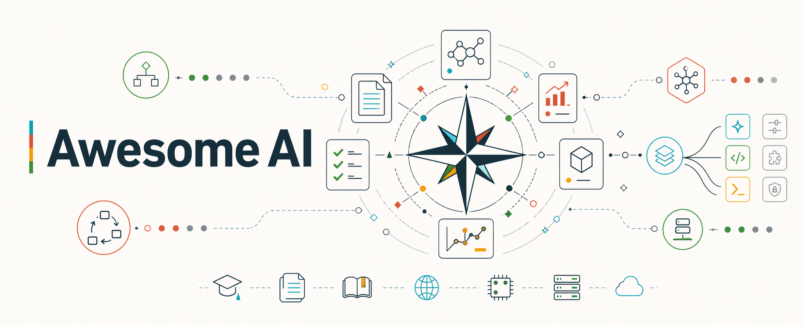
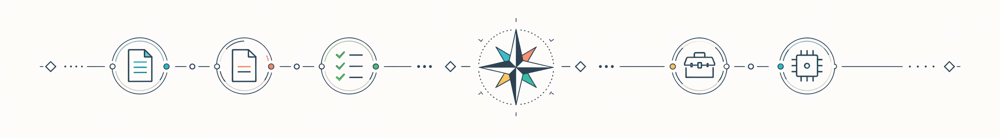

> A curated, **evidence-backed** guide to the AI landscape — prompting, agents, tool extensions, provider ecosystems, self-hosted setups, integrations, and education. Every entry carries a badge showing the evidence behind it. Nothing unlabeled.

Most "awesome AI" lists are vibes-based link dumps. This one isn't. If a technique claims to improve outputs, there's a paper, an official provider doc, or a maintainer-run test backing it. If a tool is listed, it's maintained, used, and fits a specific problem. If a hardware spec is quoted, it cites a third-party source by name.

## Contents

- [Badge legend](#badge-legend)
- [Prompting](#prompting) — evidence-backed techniques
- [Agents](#agents) — building autonomous agents
- [Extensions](#extensions) — skills, hooks, plugins, MCP servers, subagents
- [Providers](#providers) — per-provider deep dives + product surfaces
- [Self-hosted](#self-hosted) — runners, workflows, hardware
- [Integrations](#integrations) — AI + non-AI (automations, shell, CI/CD, no-code)
- [Learning](#learning) — papers, courses, architecture, safety
- [Tools](#tools) — standalone AI apps
- [Contributing](#contributing)

## Badge legend

| Badge | Meaning |
|---|---|
| <!-- [paper] --> | Peer-reviewed paper, arxiv preprint, or official provider research post |
| <!-- [provider-doc] --> | Official provider documentation |
| <!-- [tested] --> | Maintainer ran it; before/after output lives in `<category>/tests/` |
| <!-- [vetted-tool] --> | Maintained (commit within 90 days) + used + scope-fit |
| <!-- [sourced] --> | Hardware claim with a named third-party source |

No entry is bare. If something doesn't carry a badge, it doesn't belong.

  

## Prompting

Evidence-backed prompting techniques. This is the flagship section — see [prompting/README.md](prompting/README.md) for the full list and [prompting/tests/](prompting/tests/) for reproducible before/after comparisons.

- **[Chain-of-thought prompting](prompting/chain-of-thought.md)** <!-- [paper] --> — "Let's think step by step" lifts reasoning accuracy on multi-step tasks by a double-digit margin on published benchmarks.
- **[Few-shot prompting](prompting/few-shot.md)** <!-- [paper] --> — In-context examples outperform zero-shot on most tasks; example count has diminishing returns past ~8.
- **[Self-consistency](prompting/self-consistency.md)** <!-- [paper] --> — Sample multiple CoT paths and take the majority vote; beats single-sample CoT on reasoning benchmarks.
- **[Self-refine](prompting/self-refine.md)** <!-- [paper] --> — Generate → critique → revise in three phases; improves quality where the model can recognize its own errors.
- **[Tree of Thoughts](prompting/tree-of-thoughts.md)** <!-- [paper] --> — CoT generalized to a tree with explicit search; for problems where a single reasoning path isn't enough.
- **[Least-to-most prompting](prompting/least-to-most.md)** <!-- [paper] --> — Decompose into subproblems, solve them in order with answers accumulating as context.
- **[Prompt chaining](prompting/prompt-chaining.md)** <!-- [provider-doc] --> — Break complex tasks into multiple focused prompts; the default pattern for non-trivial workflows.
- **[Extended thinking / reasoning modes](prompting/extended-thinking.md)** <!-- [provider-doc] --> — Provider-native "think longer before answering" budgets on Claude, OpenAI o-series, and Gemini.
- **[Prompt caching](prompting/prompt-caching.md)** <!-- [provider-doc] --> — Reuse a static prefix across requests to cut cost ~90% and latency materially on repeated long-context calls.
- **[Structured output](prompting/structured-output.md)** <!-- [provider-doc] --> — JSON-schema-constrained generation eliminates parsing errors and reduces hallucinated fields.

## Agents

Building agents — not using them. See [agents/README.md](agents/README.md).

- **[ReAct: Reasoning + Acting](agents/react.md)** <!-- [paper] --> — Interleave Thought/Action/Observation; the pattern underlying most modern tool-using agents.
- **[Toolformer](agents/toolformer.md)** <!-- [paper] --> — Train tool-calling into the model via self-supervised filtering; the training-time complement to ReAct.
- **[Plan-and-Solve prompting](agents/plan-and-solve.md)** <!-- [paper] --> — Plan first, then execute; the planner/worker split underlying most agent frameworks.
- **[Reflexion](agents/reflexion.md)** <!-- [paper] --> — After a failed attempt, generate a verbal self-reflection and retry with it in context.
- **[Voyager](agents/voyager.md)** <!-- [paper] --> — Open-ended Minecraft agent: automatic curriculum + reusable skill library + environment-grounded feedback.
- **[SWE-Bench](agents/swe-bench.md)** <!-- [paper] --> — The benchmark to cite when evaluating code-operating agents on real GitHub issues.
- **[GAIA: General AI Assistant benchmark](agents/gaia.md)** <!-- [paper] --> — 466 real-world multi-tool, multimodal questions; grades the whole agent stack, not just the model.
- **[Tool use (Anthropic / Claude)](agents/tool-use-anthropic.md)** <!-- [provider-doc] --> — Claude's structured tool-use API: schemas, `tool_use` blocks, parallel calls.
- **[Tool use (OpenAI)](agents/tool-use-openai.md)** <!-- [provider-doc] --> — OpenAI function calling + hosted tools (`web_search`, `code_interpreter`, etc.).

## Extensions

Make your existing AI tool do more. Each extension type is its own curated list:

- **[Skills](extensions/skills/)** — Claude Agent SDK skills and equivalents
- **[Hooks](extensions/hooks/)** — lifecycle hooks in Claude Code and similar tools
- **[Plugins](extensions/plugins/)** — tool-level plugins and addons
- **[MCP Servers](extensions/mcp-servers/)** — Model Context Protocol servers
- **[Subagents](extensions/subagents/)** — specialized agent configurations
- **[Slash commands](extensions/slash-commands/)** — custom commands

*Scaffolded in v0.4. Subsection primers exist; curated entries are still being seeded.*

## Providers

Per-provider deep dives: provider overviews, a cross-provider [model directory](providers/models/), per-model pages for current first-class lines, context windows, pricing, strengths/weaknesses (cited), and product-surface pages where a provider has distinct apps or runtimes. See [providers/README.md](providers/README.md).

- **[Anthropic](providers/anthropic/)** <!-- [provider-doc] --> — Claude model families plus Claude Code, Claude Desktop, and Claude Design.
- **[OpenAI](providers/openai/)** <!-- [provider-doc] --> — GPT-5.5/GPT-5.4 model lines plus Codex, ChatGPT Desktop, and image generation.
- **[Google](providers/google/)** <!-- [provider-doc] --> — Gemini/Gemma model families plus Antigravity, Stitch, and multimodal deployment guidance.
- **[xAI](providers/xai/)** <!-- [provider-doc] --> — Grok model lines, API surface, and live-data positioning.
- **[Moonshot AI](providers/moonshot/)** <!-- [provider-doc] --> — Kimi long-context models and open-weight releases.
- **[Alibaba](providers/alibaba/)** <!-- [provider-doc] --> — Qwen general and specialist variants.
- **[DeepSeek](providers/deepseek/)** <!-- [provider-doc] --> — V3, R1, Coder, and open-weight reasoning.
- **[MiniMax](providers/minimax/)** <!-- [provider-doc] --> — M2.x text models, open-weight M1, and broader multimodal platform surfaces.
- **[Meta](providers/meta/)** <!-- [provider-doc] --> — Llama-family open weights and adjacent safety surfaces.
- **[Mistral](providers/mistral/)** <!-- [provider-doc] --> — proprietary platform + open-weight dual track.

More providers (Phi, Command R, Yi) land in a later wave.

## Self-hosted

Running models locally.

- **[Runners](self-hosted/runners/)** — ollama, LMStudio, llama.cpp, vLLM comparisons
- **[Workflows](self-hosted/workflows/)** — local-first setups that work end-to-end
- **[Hardware](self-hosted/hardware/)** — sourced hardware guides, <!-- [sourced] --> only

*Scaffolded in v0.4. Section primers exist; sourced/tested entries are still being seeded.*

## Integrations

**AI glued to non-AI systems.** This section is a genuine gap in the ecosystem — most lists stop at "here are 50 AI tools." This one shows you how to wire AI into what you already use.

- **[Automations](integrations/automations/)** — scheduled and trigger-based routines that do useful work without a fresh prompt each time
- **[CI/CD](integrations/ci-cd/)** — PR review bots, test generation, release-note automation
- **[Shell](integrations/shell/)** — AI in shell scripts, git hooks, cron jobs
- **[No-code](integrations/no-code/)** — n8n, Zapier, Make, and similar

*Scaffolded in v0.4. Section primers exist; tested/vetted entries are still being seeded.*

## Learning

Foundations, not tips. Subsections: [papers](learning/papers/), [courses](learning/courses/), [architecture explainers](learning/architecture/), [safety](learning/safety/).

### Papers — foundational

- **[Attention Is All You Need](learning/papers/attention-is-all-you-need.md)** <!-- [paper] --> — Vaswani et al. 2017. The Transformer paper. The architecture underlying every modern LLM.
- **[Scaling laws (Kaplan + Chinchilla)](learning/papers/scaling-laws.md)** <!-- [paper] --> — Kaplan 2020 + Hoffmann 2022. Why bigger works, and what ratio of parameters to data is actually compute-optimal.
- **[InstructGPT / RLHF](learning/papers/instructgpt.md)** <!-- [paper] --> — Ouyang et al. 2022. The three-stage recipe (SFT → reward model → PPO) that made ChatGPT possible.
- **[Direct Preference Optimization (DPO)](learning/papers/dpo.md)** <!-- [paper] --> — Rafailov et al. 2023. Closed-form alignment from preference data without the RL loop.
- **[Constitutional AI](learning/papers/constitutional-ai.md)** <!-- [paper] --> — Bai et al. 2022. Replace human labelers with model self-critique against a constitution — the foundation of scalable alignment.

### Safety — prompt injection, jailbreaks, red-teaming

- **[Indirect Prompt Injection](learning/safety/indirect-prompt-injection.md)** <!-- [paper] --> — Greshake et al. 2023. The foundational framing of the injection threat when agents read untrusted content.
- **[GCG: Universal Adversarial Attacks](learning/safety/gcg-attack.md)** <!-- [paper] --> — Zou et al. 2023. Automated jailbreak discovery; suffixes transfer across models.
- **[Jailbroken: How Does LLM Safety Training Fail?](learning/safety/jailbreak-failure-modes.md)** <!-- [paper] --> — Wei et al. 2023. The framework for understanding *why* jailbreaks work (competing objectives, mismatched generalization).

### Architecture — systems concepts

- **[Retrieval-augmented generation (RAG)](learning/architecture/rag.md)** <!-- [paper] --> — Retrieve external evidence, then condition generation on it.
- **[KV cache and PagedAttention](learning/architecture/kv-cache.md)** <!-- [paper] --> — Reuse attention keys and values during decoding; key serving bottleneck.
- **[Mixture-of-experts (MoE)](learning/architecture/mixture-of-experts.md)** <!-- [paper] --> — Add sparse capacity by routing tokens through selected experts.
- **[Fine-tuning and LoRA](learning/architecture/fine-tuning-lora.md)** <!-- [paper] --> — Adapt model behavior with full or parameter-efficient training.
- **[Tokenization: BPE and SentencePiece](learning/architecture/tokenization.md)** <!-- [paper] --> — Map raw text into subword token IDs.
- **[TurboQuant](learning/architecture/turboquant.md)** <!-- [paper] --> — Compress high-dimensional vectors for KV cache and vector search.

## Tools

Standalone AI apps that don't fit a category. See [tools/README.md](tools/README.md).

*Scaffolded in v0.4. No vetted entries yet.*

## Contributing

Every contribution goes through a template that enforces the evidence bar for its track. Read [CONTRIBUTING.md](CONTRIBUTING.md) before opening a PR.

Tracks and bars:

- **Techniques** (`prompting/`, `agents/`) — <!-- [paper] -->, <!-- [provider-doc] -->, or <!-- [tested] --> only.
- **Providers** (`providers/`) — official docs first; product-surface pages live under the provider that owns them.
- **Tools** (`extensions/`, `tools/`) — maintained + used + scope-fit.
- **Hardware** (`self-hosted/hardware/`) — third-party source cited by name.

## License

[CC0 1.0 Universal](LICENSE) — public domain dedication. Fork it, copy entries, build on it.
