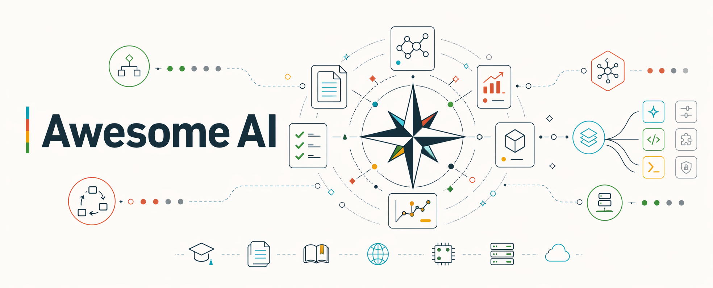

> Evidence-backed AI guidance for people choosing techniques, models, tools, and workflows.

Use this repo to move from a practical AI question to a short guide path, then into the evidence behind each recommendation. If a technique claims to improve outputs, there is a paper, an official provider doc, or a maintainer-run test backing it. If a tool is listed, it is maintained, used, and scoped to a specific problem. If a hardware spec is quoted, it cites a named source.

## Contents

- [Start With A Guide](#start-with-a-guide)
- [AI Authorship Disclosure](#ai-authorship-disclosure)
- [What This Helps You Do](#what-this-helps-you-do)
- [Section Maturity](#section-maturity)
- [Evidence Library](#evidence-library)
- [Badge Legend](#badge-legend)
- [Contributing](#contributing)

## Start With A Guide

Start with the reader goal closest to the decision in front of you. Guide pages are short editorial paths through the evidence library, not new evidence categories.

- [How to get better LLM outputs](guides/better-llm-outputs.md)
- [How to build an agent with testable boundaries](guides/build-an-agent.md)
- [How to choose a model or provider](guides/choose-a-model.md)
- [How to add AI to an existing workflow](guides/ai-in-existing-workflows.md)
- [How to think about local AI](guides/local-ai.md)
- [What to read first if you want the foundations](guides/foundations.md)

See [guides/README.md](guides/README.md) for the guide index.

## AI Authorship Disclosure

This repository is intentionally written and maintained by an AI agent as an experiment in whether an agent can fully maintain an evidence-backed public repo. The human maintainer sets direction and decides what changes land; the agent writes, organizes, revises, and maintains the repository content.

The disclosure does not loosen the evidence bar. Entries still need approved badges, narrow claims, and source-backed support.

## What This Helps You Do

- Choose a starting path when you need better outputs, an agent, a model, a workflow integration, local AI, or foundations.
- Trace each recommendation back to a paper, provider doc, maintainer-run test, vetted tool note, or sourced hardware claim.
- See caveats and maturity labels before relying on a section for a product decision.
- Compare techniques, providers, tools, and workflows without treating the repo as a ranking or news feed.

## Section Maturity

| Section | Maturity | What to expect |
|---|---|---|
| [Prompting](prompting/README.md) | Mature | Multiple cited technique pages with practical caveats. |
| [Agents](agents/README.md) | Mature | Foundational papers, tool-use docs, and agent benchmarks. |
| [Learning architecture](learning/architecture/README.md) | Mature | Practical explainers for RAG, KV cache, linear attention, MoE, tokenization, and related systems concepts. |
| [Providers](providers/README.md) | Seeded | Broad provider and model coverage, with high staleness risk. Verify live docs before committing to pricing, availability, or limits. |
| [Extensions](extensions/README.md) | Seeded | Category primers exist; vetted extension entries have not landed yet. |
| [Tools](tools/README.md) | Seeded | Vetted tools plus candidate briefs where the README explicitly allows candidates. |
| [Integrations](integrations/README.md) | Planned | Workflow categories exist, but curated entries are not mature yet. |
| [Self-hosted](self-hosted/README.md) | Planned | Runners, workflows, and hardware structure exists; sourced/tested coverage is still being seeded. |
| [Learning courses](learning/courses/README.md) | Planned | Course curation is not ready yet. |

## Evidence Library

The evidence library is the source-backed taxonomy that guide pages link into. Use it when you already know the category you need or want to inspect the underlying evidence directly.

### Mature Sections

#### Prompting

Evidence-backed techniques for improving model outputs. See [prompting/README.md](prompting/README.md) and [prompting/tests/](prompting/tests/).

- **[Chain-of-thought prompting](prompting/chain-of-thought.md)** <!-- [paper] --> — Step-by-step reasoning for multi-step tasks, with cost and verbosity tradeoffs.
- **[Few-shot prompting](prompting/few-shot.md)** <!-- [paper] --> — In-context examples for task format and behavior steering.
- **[Self-consistency](prompting/self-consistency.md)** <!-- [paper] --> — Sample multiple reasoning paths and choose the majority answer.
- **[Self-refine](prompting/self-refine.md)** <!-- [paper] --> — Generate, critique, and revise where the model can recognize its own errors.
- **[Tree of Thoughts](prompting/tree-of-thoughts.md)** <!-- [paper] --> — Search over multiple reasoning branches for problems where one path is not enough.
- **[Least-to-most prompting](prompting/least-to-most.md)** <!-- [paper] --> — Decompose a problem and solve subproblems in sequence.
- **[Prompt chaining](prompting/prompt-chaining.md)** <!-- [provider-doc] --> — Split complex workflows into focused prompt steps.
- **[Extended thinking / reasoning modes](prompting/extended-thinking.md)** <!-- [provider-doc] --> — Provider-native reasoning budgets for harder tasks.
- **[Prompt caching](prompting/prompt-caching.md)** <!-- [provider-doc] --> — Reuse static prefixes on repeated long-context calls.
- **[Structured output](prompting/structured-output.md)** <!-- [provider-doc] --> — Schema-constrained generation for machine-readable outputs.

#### Agents

Agent-building patterns, tool-use docs, and evaluation references. See [agents/README.md](agents/README.md).

- **[ReAct: Reasoning + Acting](agents/react.md)** <!-- [paper] --> — Interleave reasoning, actions, and observations for tool-using agents.
- **[Toolformer](agents/toolformer.md)** <!-- [paper] --> — Training-time tool-use behavior from self-supervised filtering.
- **[Plan-and-Solve prompting](agents/plan-and-solve.md)** <!-- [paper] --> — Plan first, then execute.
- **[Reflexion](agents/reflexion.md)** <!-- [paper] --> — Verbal self-reflection after failed attempts.
- **[Voyager](agents/voyager.md)** <!-- [paper] --> — Open-ended agent loop with curriculum, skill library, and environment feedback.
- **[SWE-Bench](agents/swe-bench.md)** <!-- [paper] --> — Real GitHub issues as an agent-coding benchmark.
- **[GAIA: General AI Assistant benchmark](agents/gaia.md)** <!-- [paper] --> — Multi-tool, multimodal benchmark for whole-agent behavior.
- **[Tool use (Anthropic / Claude)](agents/tool-use-anthropic.md)** <!-- [provider-doc] --> — Claude tool-use schemas, tool blocks, and parallel calls.
- **[Tool use (OpenAI)](agents/tool-use-openai.md)** <!-- [provider-doc] --> — OpenAI function calling and hosted tools.

#### Learning Architecture

Foundational systems concepts for understanding how LLM applications behave. See [learning/architecture/README.md](learning/architecture/README.md).

- **[Retrieval-augmented generation (RAG)](learning/architecture/rag.md)** <!-- [paper] --> — Retrieve external evidence, then condition generation on it.
- **[KV cache and PagedAttention](learning/architecture/kv-cache.md)** <!-- [paper] --> — Reuse attention keys and values during decoding.
- **[Multi-token prediction (MTP)](learning/architecture/multi-token-prediction.md)** <!-- [paper] --> — Draft and verify several future tokens per decoding step.
- **[Kimi Linear / Kimi Delta Attention (KDA)](learning/architecture/kimi-linear.md)** <!-- [paper] --> — Mix KDA and MLA layers to reduce long-context cache and decode costs.
- **[Mixture-of-experts (MoE)](learning/architecture/mixture-of-experts.md)** <!-- [paper] --> — Route tokens through selected experts to add sparse capacity.
- **[Fine-tuning and LoRA](learning/architecture/fine-tuning-lora.md)** <!-- [paper] --> — Adapt a pretrained model to a task or domain.
- **[Tokenization: BPE and SentencePiece](learning/architecture/tokenization.md)** <!-- [paper] --> — Map text into subword token IDs.
- **[TurboQuant](learning/architecture/turboquant.md)** <!-- [paper] --> — Compress high-dimensional vectors for KV cache and vector search.

### Seeded Sections

#### Providers

Provider and model pages are useful starting points, but they are date-sensitive. Check official docs before acting on pricing, context windows, model availability, or product limits. See [providers/README.md](providers/README.md).

- **[Provider model directory](providers/models/README.md)** <!-- [provider-doc] --> — Cross-provider map of seeded model pages and docs-only model lines.
- **[Anthropic](providers/anthropic/README.md)** <!-- [provider-doc] --> — Claude model families and Anthropic-specific product surfaces.
- **[OpenAI](providers/openai/README.md)** <!-- [provider-doc] --> — GPT model lines plus Codex, ChatGPT Desktop, and image-generation surfaces.
- **[Google](providers/google/README.md)** <!-- [provider-doc] --> — Gemini/Gemma models and Google-specific product surfaces.
- **[xAI](providers/xai/README.md)** <!-- [provider-doc] --> — Grok models, API surface, and live-data positioning.
- **[Moonshot AI](providers/moonshot/README.md)** <!-- [provider-doc] --> — Kimi long-context models and open-weight releases.
- **[Alibaba](providers/alibaba/README.md)** <!-- [provider-doc] --> — Qwen general and specialist variants.
- **[DeepSeek](providers/deepseek/README.md)** <!-- [provider-doc] --> — Reasoning and open-weight long-context model pages.
- **[MiniMax](providers/minimax/README.md)** <!-- [provider-doc] --> — M2.x text models, open-weight M1, and multimodal platform surfaces.
- **[Meta](providers/meta/README.md)** <!-- [provider-doc] --> — Llama-family open weights and adjacent safety surfaces.
- **[Mistral](providers/mistral/README.md)** <!-- [provider-doc] --> — Proprietary platform plus open-weight track.

#### Extensions

Extension categories explain surfaces that make existing AI tools do more. Some entries are seeded, but several subsections are still primers. See [extensions/README.md](extensions/README.md).

Current primer indexes, not finished evidence entries: [Skills](extensions/skills/), [Hooks](extensions/hooks/), [Plugins](extensions/plugins/), [MCP Servers](extensions/mcp-servers/), [Subagents](extensions/subagents/), and [Slash commands](extensions/slash-commands/).

#### Tools

Standalone AI tools that do not fit a narrower category. See [tools/README.md](tools/README.md).

- **[Hermes Agent](tools/candidates/hermes-agent.md)** <!-- [vetted-tool] --> — Self-hosted persistent agent for scheduled codebase maintenance.
- **[OpenClaw](tools/candidates/openclaw.md)** <!-- [vetted-tool] --> — Messaging-native personal assistant for codebase maintenance.
- **[OpenShell](tools/candidates/openshell.md)** <!-- [vetted-tool] --> — Policy-governed sandbox runtime for autonomous coding agents.
- **[Pi Agent](tools/candidates/pi-agent.md)** <!-- [vetted-tool] --> — Minimal terminal coding harness for custom provider and extension workflows.

### Planned Sections

These sections stay visible because they describe intended coverage, but readers should not treat them as complete curated lists yet.

- [Integrations](integrations/README.md) — AI wired into automations, shell workflows, CI/CD, and no-code systems.
- [Self-hosted](self-hosted/README.md) — Local runners, local-first workflows, and sourced hardware guidance.
- [Learning courses](learning/courses/README.md) — Curated course material after the evidence bar is settled.

## Badge Legend

| Badge | Meaning |
|---|---|
| <!-- [paper] --> | Peer-reviewed paper, arxiv preprint, or official provider research post |
| <!-- [provider-doc] --> | Official provider documentation |
| <!-- [tested] --> | Maintainer ran it; before/after output lives in `<category>/tests/` |
| <!-- [vetted-tool] --> | Maintained, used, and scope-fit |
| <!-- [sourced] --> | Hardware claim with a named source |

## Contributing

Every contribution goes through a template that enforces the evidence bar for its track. Read [CONTRIBUTING.md](CONTRIBUTING.md) before opening a PR.

Tracks and bars:

- **Techniques** (`prompting/`, `agents/`) — <!-- [paper] -->, <!-- [provider-doc] -->, or <!-- [tested] --> only.
- **Providers** (`providers/`) — official docs first; product-surface pages live under the provider that owns them.
- **Tools** (`extensions/`, `tools/`) — maintained, used, and scope-fit.
- **Hardware** (`self-hosted/hardware/`) — named source required for specs, benchmarks, and compatibility claims.

## License

[CC0 1.0 Universal](LICENSE) — public domain dedication. Fork it, copy entries, build on it.
